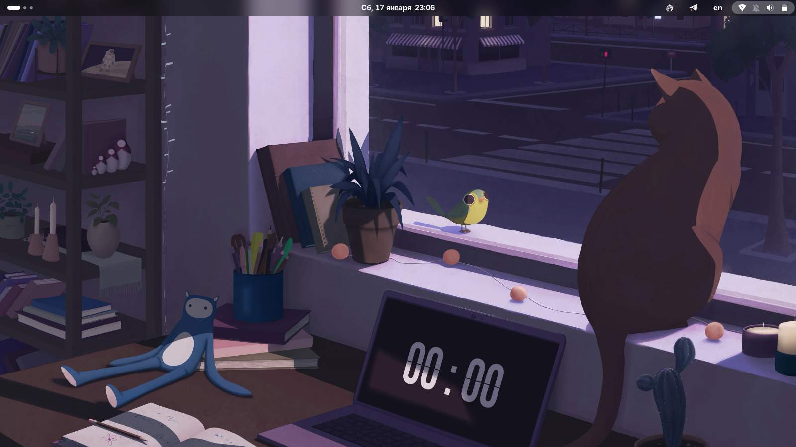
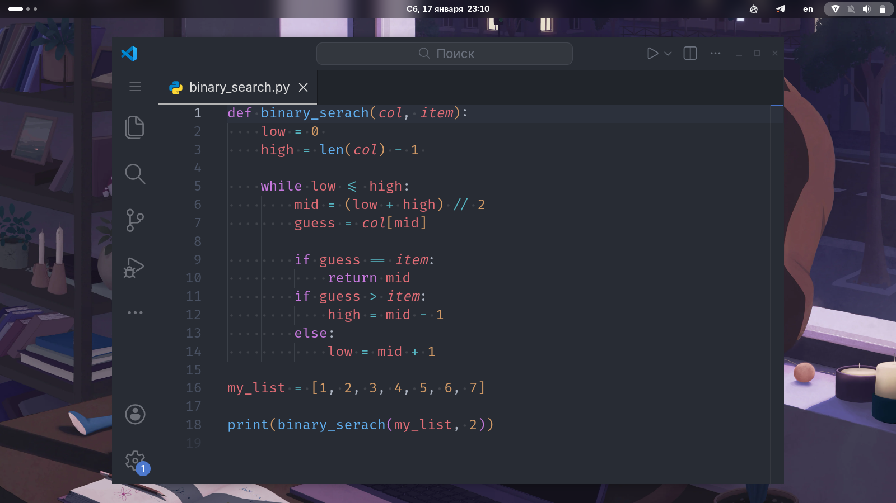
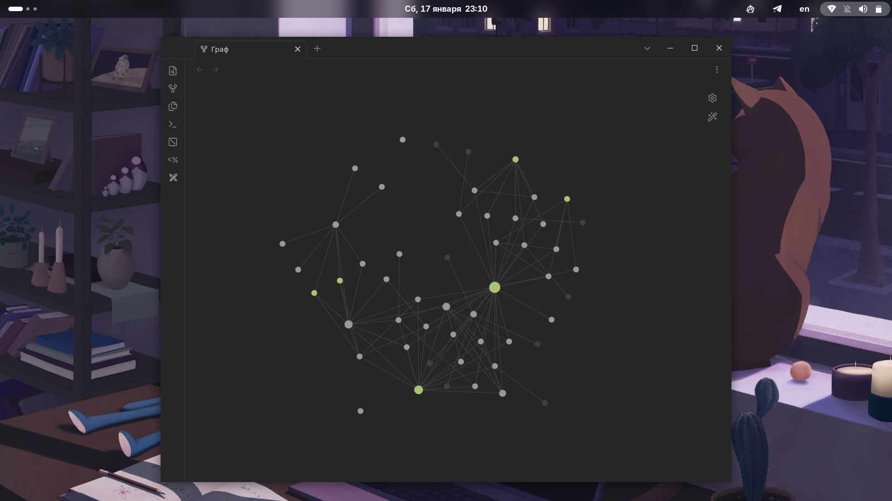
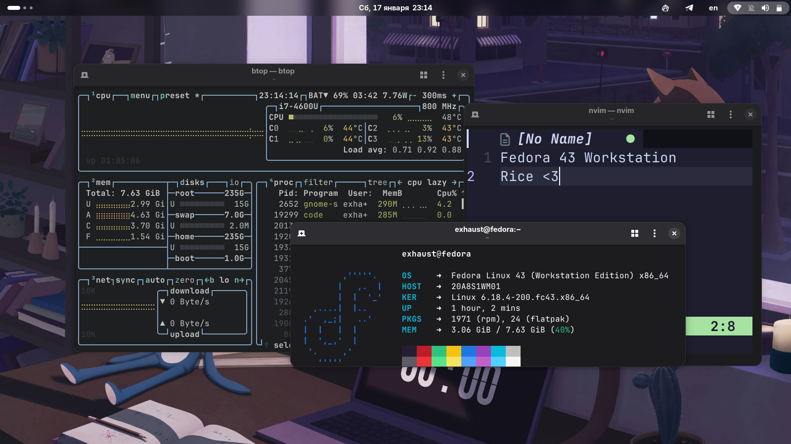

# 💻 Fedora Workstation Rice

Привет! Это мой уютный уголок настроек (dotfiles) для **Fedora 43**.
Я собрал здесь всё, что помогает мне комфортно программировать, учиться и общаться, придерживаясь принципа **KISS** (Keep It Simple, Stupid).

Мои главные ориентиры: **Простота. Стабильность. Предсказуемость.**

---

## 📸 Скриншоты

---

## 🛠 Железо

Система работает на легендарном «инструменте для работы», который до сих пор в строю:

- **Модель:** Lenovo ThinkPad X1 Carbon Gen 2
- **Процессор:** Intel Core i7-4600U
- **Память:** 8GB DDR3

---

## 📦 Мой софт

Набор инструментов, проверенный временем:

- **Интернет:** Firefox, Telegram, Discord
- **Код:** VS Code (One Dark Pro), Neovim
- **Терминал:** Fastfetch, btop, bat
- **Заметки:** Obsidian, OnlyOffice
- **Безопасность:** KeePassXC

---

## 🎨 Стилизация

### Интерфейс

- **Шрифт:** `Fira Code` (лучший выбор для кода).
- **Расширения Gnome:** `Blur my shell` — добавляет эстетичный блюр.
- `AppIndicator` — возвращает нужные иконки в трей.

### Obsidian (Второй мозг)

- **Тема:** Minimal
- **Плагины:** Templater, Excalidraw
